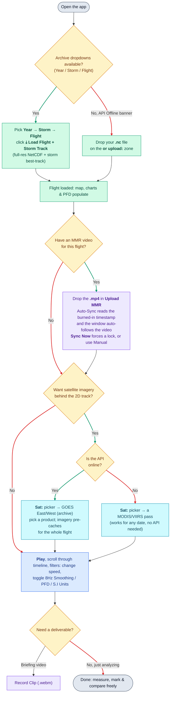

# Mission Visualizer

This tool replays AOC flight-level instrument data together with optional synced radar
(**MMR**) video. It adds a live 2D/3D map tracker, synced charts for any recorded variable, a
cockpit Primary Flight Display, satellite imagery overlays, storm best-track overlays,
cross-flight comparison, and clip recording.

Built for the **Aircraft Operations Center**. Runs entirely in the browser; the archive API adds
more automation (loads flight from archive) but is optional.

- **Tool Link:** https://diegoxb07.github.io/AOCVisualizer/ (GitHub Pages)
- **Repository:** https://github.com/diegoxb07/AOCVisualizer

---

## Decision Flowchart

You can use this flowchart in case you are unsure of what to do:

---

## What it's for

| Use case | What the tool gives you |
| --- | --- |
| **Training** | Replay a real mission at any speed, slide to any moment, and watch the aircraft state (attitude, winds, altitude, speeds) change live on the map, PFD, and graphs, with the MMR video synced alongside. Clips can be recorded ahead of time for presentations. |
| **Replay / analysis** | Load flight-level data or pull a whole mission from the archive, trim to a time window, color the track by wind speed or temperature, drop measurement shapes, run point analyses, overlay satellite imagery for the flight's date, and record annotated clips. |
| **API-backed workflow** | The built-in **Recon Archive** browser (Year → Storm → Flight) loads full-resolution mission NetCDF and the storm's whole-life best-track automatically, and archive **GOES** imagery is rendered on demand for the historical dates these flights fall on. |

---

## 1. Loading a flight

> **Tip: batch load flight data first.** Click **⤓ Batch Load Flight Data** after picking a year and check every mission you plan to look at. They download and parse once in the background and are saved on this device, so they open instantly from **Previously Loaded Missions**, even after a page reload.

Both loading paths feed the same parser, so the map, charts, PFD, and export behave identically either way.

**Option 1: Archive browser (needs the API online).** Pick **Year → Storm → Flight** in the top-left card, then click **⤓ Load Flight + Storm Track**. The search box above the dropdowns also works: paste a full mission id to load it directly, or type a storm name (no year needed) to find that storm across every season; clicking a result shows its flights. This streams the mission's full-resolution NetCDF with a byte-progress readout, parses every recorded variable, and loads the storm's whole-life best-track. The **⬇ .nc** link that appears opens the original source file for use in other tools. If the download fails, the tool falls back to a decimated (0.2 Hz) track, and the status text says which path ran. The address bar also updates to a shareable link (`?mission=20241007N1`); a colleague who opens that link gets the same mission loaded automatically. A shared link only auto-loads on first open. Refreshing the page, or clicking **↺ Reset** in the top right, clears everything back to a fresh session.

**Option 2: Manual upload (works offline).** Drop a **`.txt`** or **`.nc`** file (for example `20221028H1_A.nc`) on the **"or upload:"** zone. Manually loaded flights have no storm best-track; that only comes with an archive load.

> When the archive dropdowns are greyed out with an **"API Offline"** banner, this means the archive service is unreachable. Use manual upload instead. The tool re-checks the service every 60 seconds and re-enables the archive when it recovers. Details: **[API & Connectivity](docs/CONNECTIVITY.md)**.

---

## 2. Time window & replay controls

Set **Flight-Data Start / End Time** (`HHMMSS` UTC) to replay just a segment; the map, charts, PFD, and timeline then render only that window. Leave the detected range alone to replay the whole flight. **After changing the window, press Play. It applies the new window before starting playback.**

With a synced MMR video loaded, the window follows the video's timeframe, so manual trimming mainly applies to data-only replay and Manual sync mode.

All playback lives in the sticky bottom bar:

| Control | What it does |
| --- | --- |
| **`Play` / `Pause`** | Start and stop. |
| **`« / 1x / »`** | Playback speed. |
| **`↻ Reset`** | Jump back to the start of the window. |
| **Timeline slider** | Slide to any moment; the UTC readout updates live. |
| **8Hz Smoothing** (map header) | Interpolates between the native 1-second samples so motion is fluid instead of stepping. |

Keyboard: **Space** plays and pauses, **← / →** slide through the timeline (hold to accelerate), and **Shift + ← / →** jump 10 flight-minutes. Display preferences (units, tracker mode, track and barb colors, PFD, smoothing) are remembered between sessions.

If an MMR video is loaded, the video clock drives playback and the telemetry follows it. Otherwise the engine advances on its own clock.

---

## 3. The map tracker (2D & 3D)

Switch with the **2D Map Tracker / 3D WebGL Tracker** dropdown in the map header.

- **2D**: a whole-world canvas map (coastlines, US states) with satellite imagery and **wind barbs**. Wheel to zoom and drag to pan; zooming out shows the surrounding synoptic picture. Airfield codes appear as you zoom in, and the AOC's home field (LAL) is always marked.
- **3D**: a Three.js scene over an elevation-shaded terrain basemap, with US state names laid on the ground, a detailed aircraft model, and the track drawn at altitude (GPS or pressure, selectable; defaults to GPS). Orbit and zoom with the mouse. **Real Scale (3D)** draws the aircraft at its true size and adds faint flight-level reference planes so climbs and descents read against them.

Options (bottom bar): **Track Color** (wind speed, or warming/cooling), **Barb Color** (wind speed, or hurricane wind field), **3D Track Altitude** (GPS or pressure altitude for the 3D height, independent of the PFD's altitude filter), and **Simple Icon (2D)**. Use **⛶** for fullscreen presentations.

> **Hurricane Wind Field coloring:** barbs (and the track, in that mode) stay black until the flight-level data records hurricane-force winds. Color starts at **64 kt** and steps through the Saffir-Simpson categories from there. A fully black track means the aircraft never sampled hurricane-force winds.

> **3D wind streaks:** the short streaks at the wings show vertical air motion. They need the **3D** tracker, **playback running**, and a vertical bump past the threshold: either vertical wind (`vtWnd`) above about 2 m/s, or the vertical rate changing by more than about 2.8 m/s within 3 seconds, so a file with no vertical-wind channel still shows them. They rise in an updraft, fall in a downdraft, and brighten and speed up with stronger motion. Smooth air shows nothing.

> **TDR radar:** when the archive has Tail Doppler Radar for the loaded mission, a **TDR Radar** toggle and a **TDR:** picker appear in the map header. On the 3D tracker, each radar analysis is a 3D reflectivity column (every altitude level, 0 to 18 km) that scans in around the aircraft as it flies the leg, building the mosaic until the full composite is visible by the end of the radar section; a tall white beam marks the aircraft inside the volume, and the camera pulls back once when radar first appears so the whole volume is framed. The **TDR:** picker groups the radar levels into pressure bands (millibars, 900-1000 mb up through under 100 mb): click bands to show them over the 2D map or filter the 3D stack, alone or combined, with an opacity slider that applies to both, and the **Cross-section** tool draws a vertical slice between any two points you click on the 2D map. Only post-season quality-controlled (level 2) radar is used; a mission carrying just the real-time product shows the TDR control as unavailable. Missions before 2021 use an older grid format the API cannot render and are skipped.

**Measure & mark:** **Measure** (map header) draws a polygon, circle, or rectangle for distance and area. **Mark Point** (bottom bar) drops a marker at the current position. Clicking a marked point opens **Point Data Analysis**, where its full report can be downloaded.

---

## 4. MMR video sync

Load a cockpit or radar **`.mp4`** in the **Upload MMR** zone. Two sync modes:

- **Auto-Sync (default)**: OCR reads the timestamp burned into the video frame and aligns the data to it. A green pulse means OCR is active, and a "Syncing" pill shows while it hunts. Click **Sync Now** to force a lock (a few clicks on a clear frame helps), and hide any other on-screen timestamps that could confuse it. Reads are sanity-checked against the flight's time range, so a misread cannot jump playback wildly.
- **Manual Time Input**: type the video's UTC start time in **MMR Start Time** (`HHMMSS`).

---

## 5. Satellite overlays

Open the **Sat:** picker in the map header and choose a satellite; its products then appear right below. A slider at the top of the picker adjusts the imagery's opacity over the basemap, and for GOES products a color-scale legend (brightness temperature or reflectance, with units) sits in the top left of the 2D player. The options fill in from the flight's date and location.

- **MODIS / VIIRS (polar orbiters, NASA GIBS)**: available for any date back to each mission's start. Imagery is organized by calendar day; the day-stepper moves between days, and overpass times are looked up automatically.
- **GOES-East / GOES-West (archive, needs the API)**: rendered server-side from the GOES archive for the flight's date, advancing on the 10-minute scan interval as playback runs. Nothing shows until a product is chosen, and choosing one also pre-caches imagery for the whole flight so playback never waits on a download. A product the API cannot currently serve is shown as unavailable on its own; the rest stay usable.
- **⤓ Pre-Cache Satellite Imagery** (top card) downloads imagery for several flights at once. Cached imagery is saved on this device and survives reloads.

The picker discovers the product list from the API at startup, so new products appear without an app update. The full 16-band GOES ABI set is available for both GOES satellites, plus two composites:

- **Bands 1-6** (visible and near-IR, daylight only; a warning shows if the flight point is in darkness): Band 2 (Red Visible, 0.64 µm) has the sharpest daytime cloud and convection detail, Band 3 (Veggie, 0.86 µm) shows land and vegetation, and Band 5 (Snow/Ice, 1.6 µm) separates ice cloud from water cloud.
- **Band 7** (Shortwave IR, 3.9 µm): low cloud and fog at night.
- **Bands 8-10** (Water Vapor, 6.2 / 6.9 / 7.3 µm): upper, mid, and low-level moisture, dry slots, and shear.
- **Bands 11-16** (IR windows and trace-gas channels): cloud-top temperature, day or night. Band 13 (Clean IR, 10.3 µm) is the usual pick, and is also offered as **IR Enhanced (ir4)** and **BD Curve (Dvorak)** variants.
- **Sandwich** (composite): Band 13 IR color over visible texture, for daytime convection.
- **GeoColor** (composite): true color by day, IR at night.

---

## 6. Storm best-track overlay

Archive loads draw the storm's whole-life, intensity-colored, dashed best-track on both trackers. It starts on; the **Storm Track** checkbox (map controls) hides it. The **Last Storm Observation** card shows the best-track fix nearest to the playback time, and hovering a track point on the 2D map shows its category, wind, pressure, and time.

---

## 7. Charts, PFD & HUD

Eight synced charts (temperature, nav angles, flow angles, altitude, speeds, vertical speeds and accelerations, pressure, thermodynamics) follow the playback moment. **↺** resets zoom, **＋** adds or removes series, and scroll or drag zooms and pans. **Create Your Own Graph** (bottom) plots any variables the file contains against each other.

Filters (bottom bar): **Cockpit PFD** (a G1000-style primary flight display with an attitude ladder, airspeed/altitude/heading tapes, VSI, a bank scale with a slip/skid indicator, wind box, ground-track diamond, and OAT/GS/TAS/IAS readouts), **S.I Units** (readouts are imperial by default; checking it switches them to metric), and **GPS→Press Alt** (switches the PFD altitude tape from GPS to pressure altitude, when both exist). The HUD box on the map shows live telemetry text.

**8Hz Smoothing** (map header) interpolates between the 1-second samples for fluid playback. The small sub-second motion it adds scales with the recorded vertical wind, so calm legs stay smooth and only genuinely bumpy air moves the airframe.

---

## 8. Comparing flights

**Metrics Across Flights** (top card) scans every loaded flight, or a subset you pick, for the highest or lowest value of a chosen metric. It ranks the flights, reports each one's peak with its time, altitude, and position, and draws them together on one comparison graph. It works offline on whatever is already loaded, and the currently open flight is not touched.

---

## 9. Exporting

**Record Clip**: pick a start and end time (both endpoints preview live, so the exact frames are visible before recording), a tracker mode, a satellite overlay, the MMR video if one is loaded, and up to four graphs. Custom graphs can also be built from any variables just for the clip. The tool plays the range and records it to a 1080p **`.webm`**, with a progress pill and a **■ Stop** button. Recorded graphs get value and bound annotations drawn over them.

---

## Troubleshooting

| Symptom | What it means and what to do |
| --- | --- |
| The archive dropdowns are greyed out with an **"API Offline"** banner. | The archive service is unreachable. Load flights by manual upload; the tool re-checks every 60 seconds and re-enables the archive when the service returns. See [API & Connectivity](docs/CONNECTIVITY.md). |
| A GOES option is greyed out. | Either the API is offline, or the flight is outside that satellite's view of the Earth. An Atlantic flight greys out GOES-West, and an east-Pacific flight greys out GOES-East. Use the other GOES or MODIS/VIIRS. |
| A GOES satellite is picked but nothing shows. | Products are not auto-selected. Pick a product in the **Sat:** picker first. |
| Auto-Sync lands on the wrong time. | Click **Sync Now** on a frame where the burned-in timestamp is clear, hide any other on-screen timestamps, or switch to **Manual** mode. |
| The charts and map do not update after changing the time window. | Press **`Play`**. It applies the current window before starting. |
| Nothing plays. | Load a flight file first, then press **`Play`**. |
| Playback is sluggish with satellite imagery on. | Let the pre-cache finish, or cache the imagery ahead of time with **⤓ Pre-Cache Satellite Imagery**. |
| You found a bug, or have a question or idea. | Click the **!** button in the top right. It opens a report form addressed to **diegoxiaobarbero@gmail.com**, and **Send** opens Gmail with the subject, details, and mission id prefilled. |

---

## Documentation

| Doc | Read it for |
| --- | --- |
| **[API & Connectivity](docs/CONNECTIVITY.md)** | What the external API does, how the app detects online vs. offline, and exactly what still works (and what's disabled) in each state. |

---

## Running, architecture & deploying

- **Running:** open https://diegoxb07.github.io/AOCVisualizer/ in a browser, or serve the repo directory with any static file server (`python3 -m http.server`, for example). Everything the page needs (libraries, fonts, basemap data, the Auto-Sync OCR engine) ships in the repo and is served same-origin, so nothing loads from a CDN and manual uploads replay with no internet.
- **Architecture:** plain HTML, CSS, and classic scripts, with no build step. [index.html](index.html) carries the markup, and the numbered files in `js/` (split by subsystem) share one global scope and load in order. File parsing runs in a **web worker** (`js/parse-worker.js`), so a large flight file never freezes the page; the worker, the page, and the tests all share the one parser core in `js/11b-parser-core.js`, so every path produces identical rows. Batch-loaded missions and satellite imagery persist in **IndexedDB**, which is what lets them survive reloads.
- **Offline (`sw.js`).** A service worker precaches every same-origin asset (page, css/js, libs, fonts, basemap data, OCR engine) on the first visit to the Pages URL and serves it cache-first from then on, so after one online load the page opens and replays flights with no network; [API & Connectivity](docs/CONNECTIVITY.md) has the full online/offline matrix. Cross-origin requests (recon-api, NASA GIBS, the GeoJSON fallback) pass straight through uncached, so the API health check still sees real failures and the "API Offline" banner keeps working. The deploy workflow stamps `CACHE_VERSION` in `sw.js` with the commit SHA (the same `sed` that stamps the `?v=` tokens), so every deploy installs a fresh cache (each file revalidated against the server, never trusted to the HTTP cache) and drops the previous one on activate; cached files are matched ignoring the query string. The first load after a deploy still renders the old build while the new cache installs in the background; the reload after that shows it, so a live replay session is never interrupted. Two rules keep it honest: **every added or renamed css/js/font/data file must also be added to `PRECACHE` in `sw.js`** (`cache.addAll` rejects wholesale on a single 404 and the app silently stays online-only), and cache names keep the **`aoc-viz-`** prefix because the `github.io` origin is shared with sibling project pages, so cleanup only ever deletes this app's own caches. The worker registers only on `github.io`; localhost previews stay service-worker-free and always serve the working tree.
- **Deployment:** GitHub Pages via [.github/workflows/static.yml](.github/workflows/static.yml). The workflow rewrites every `?v=` cache-buster to the deploy's commit SHA, so a push always reaches browsers fresh.
- **Checks:** `node tests/run-tests.js` runs the parser checks (synthetic fixtures; a FLAG means a parser judgment call no longer matches its independently computed expectation). Verify UI changes by opening the page and exercising the load and playback flow.

---

## Appendix: flight-level variables & sensors

AOC flight-level files carry **hundreds** of columns, but this visualizer reads only the quality-controlled subset it needs to plot: position, GPS/pressure/radar altitude, D-value, pressures, temperature and dew point, true/indicated airspeed, wind speed/direction/vertical wind, drift, heading, ground track, pitch/roll, angle of attack and sideslip, vertical acceleration, mixing ratio, and equivalent potential temperature. Those are the fields shown in the charts, PFD, HUD, and "Create Your Own Graph."

Most raw columns come in **redundant sensors** (`.1`, `.2`, `.3` …), and after each flight a quality-assurance pass picks the best one as the **reference** (the `ref` suffix, e.g. `THDGref`, `LATref`). This tool reads those references (falling back to sensor `.1`) because it works with already-QC'd data. Column suffixes: `.d` derived, `.c` corrected, `.N` sensor index, `ref` chosen reference; families include INE (inertial), GPS, air-data unit (ADDU), dropsonde (`DS_`), and the SFMR surface-wind radiometer.

Values are stored metric internally, and readouts display **imperial by default** (feet, mph, °F); the **S.I Units** checkbox switches the display to metric. Knots and nautical miles are never converted. A variable that isn't present in the uploaded file is greyed out.

## Appendix: how values are computed

Everything the app plots is taken from the file as loaded or derived from it in known, standard ways. The derivations:

**Unit normalization.** Values are stored metric. Where a source channel is in m/s it is converted to knots (× 1.94384) for wind speed, true airspeed, and indicated airspeed; a radar altitude given in feet is converted to metres (× 0.3048). The **S.I Units** checkbox changes the display only (see the appendix above).

**Pressure altitude.** When a recorded pressure altitude is missing, it is computed from static pressure `P` (mb) with the standard-atmosphere formula `alt_m = (1 − (P / 1013.25)^0.190284) × 44307.69`.

**Temperature baseline.** The warming/cooling track color compares each sample's ambient temperature to a rolling **±300-sample** (about ±5 min at 1 Hz) mean, kept as a sliding-window sum so a long flight does not recompute the window each step.

**8 Hz smoothing (playback interpolation).** For fluid playback the map plane, PFD, and HUD are interpolated between the 1-second samples at 8 Hz with a uniform **Catmull-Rom** spline: position, heading and ground track, pitch and roll, and altitude, with longitude and headings unwrapped the short way so a dateline crossing or a 359°→1° turn interpolates correctly. A small **turbulence-aware micro-motion** is then added so the airframe is never perfectly still: its amplitude scales with the recorded vertical wind (`vtWnd`, the turbulence proxy) and its shape is smooth band-limited noise (a few sub-2 Hz sinusoids), so calm legs stay steady and only bumpy air rocks the plane. The drawn 2D and 3D flight tracks use the same Catmull-Rom curve (one cubic Bezier per 1-second segment in 2D), so the plane always rides on the line.

**3D wind streaks (updraft/downdraft cue).** In the 3D view, a few small vertical streaks near the fuselage rise on an updraft and fall on a downdraft. They are driven by a signed "vertical bump": the recorded vertical wind (`vtWnd`) scaled down, or, if larger, the jerk (the change in the plane's vertical rate over a few seconds, where the vertical rate is the altitude change over a ±4-second window). Streaks appear only once that signal passes a threshold, so they mark clear updrafts and downdrafts rather than minor bumps, and their brightness and speed scale with its size.

**Satellite day/night check.** The warning that a daylight-only product (reflective GOES bands 1 to 6) is being viewed after dark comes from a low-precision solar-position calculation (solar declination plus the equation of time) that gives the sun's elevation angle at the flight point and time; below −6° (past civil twilight) it counts as night.

> The app also carries an internal dictionary of the full raw-variable set (`js/00-var-catalog.js`) that it does **not** yet use for playback. It's groundwork for a future **Quality-Check mode** that would list every variable in a file, overlay and cross-compare a measurement's redundant sensors, and flag data gaps, spikes, or sensor disagreement.
