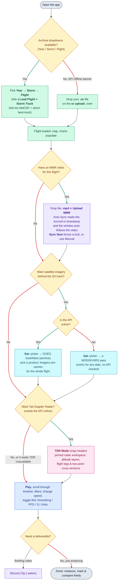

# Mission Visualizer

Replay an AOC mission in the browser: flight-level instrument data, the MMR radar video beside it,
a 2D or 3D map tracker, charts for any recorded variable, a cockpit Primary Flight Display,
satellite imagery, storm best-track, tail Doppler radar, cross-flight comparison, and clip
recording.

Meant/built for the Aircraft Operations Center. Everything runs client side with the option of the archive API which adds
automation on top (browsing seasons, loading a mission by id, archive GOES imagery), but
the tool will still work without it.

Tool: https://diegoxb07.github.io/AOCVisualizer/ (subject to change)

Repository: https://github.com/diegoxb07/AOCVisualizer

## Not sure where to start?

```mermaid
flowchart TD
    START(["Open the app"]) --> ARCHIVE{"Archive dropdowns available?<br>(Year / Storm / Flight)"}
    ARCHIVE -- "Yes" --> LOADARC["Pick <b>Year → Storm → Flight</b><br>click <b>⤓ Load Flight + Storm Track</b><br>(full-res NetCDF + storm best-track)"]
    ARCHIVE -- "No, API Offline banner" --> UPLOAD["Drop your <b>.nc</b> file<br>on the <b>or upload:</b> zone"]
    LOADARC --> LOADED["Flight loaded: map, charts populate"]
    UPLOAD --> LOADED
    LOADED --> MMR{"Have an MMR video<br>for this flight?"}
    MMR -- "Yes" --> VIDEO["Drop the <b>.mp4</b> in <b>Upload MMR</b><br>Auto-Sync reads the burned-in timestamp<br>and the window auto-follows the video<br><b>Sync Now</b> forces a lock, or use Manual"]
    MMR -- "No" --> SAT{"Want satellite imagery<br>behind the 2D track?"}
    VIDEO --> SAT
    SAT -- "Yes" --> FROMARC{"Is the API<br>online?"}
    FROMARC -- "Yes" --> SATGOES["<b>Sat:</b> picker → GOES East/West (archive)<br>pick a product; imagery pre-caches<br>for the whole flight"]
    FROMARC -- "No" --> SATPOLAR["<b>Sat:</b> picker → a MODIS/VIIRS pass<br>(works for any date, no API needed)"]
    SAT -- "No" --> TDRQ{"Want Tail Doppler Radar?<br>(needs the API online)"}
    SATGOES --> TDRQ
    SATPOLAR --> TDRQ
    TDRQ -- "Yes" --> TDRMODE["<b>TDR Mode</b> (map header)<br>pinned radar workspace: altitude layers,<br>flight legs & two-point cross-sections"]
    TDRQ -- "No, or it reads TDR Unavailable" --> PLAY["<b>Play</b>, scroll through timeline, filters: change speed,<br>toggle 8Hz Smoothing / PFD / S.I Units"]
    TDRMODE --> PLAY
    PLAY --> EXPORT{"Need a deliverable?"}
    EXPORT -- "Briefing video" --> CLIP["Record Clip (.webm)"]
    EXPORT -- "No, just analyzing" --> DONE(["Done: measure, mark & compare freely"])

    classDef decision fill:#fef3c7,stroke:#d97706,color:#78350f
    classDef data fill:#d1fae5,stroke:#059669,color:#064e3b
    classDef mmr fill:#ede9fe,stroke:#7c3aed,color:#4c1d95
    classDef sat fill:#cffafe,stroke:#0891b2,color:#164e63
    classDef tdr fill:#fce7f3,stroke:#db2777,color:#831843
    classDef playback fill:#dbeafe,stroke:#2563eb,color:#1e3a8a
    classDef term fill:#e2e8f0,stroke:#475569,color:#0f172a
    class ARCHIVE,MMR,SAT,FROMARC,TDRQ,EXPORT decision
    class LOADARC,UPLOAD,LOADED data
    class VIDEO,CLIP mmr
    class SATGOES,SATPOLAR sat
    class TDRMODE tdr
    class PLAY playback
    class START,DONE term
    %% linkStyle numbers = edge definition order above; update them if edges are added or reordered
    linkStyle 1,6,9,10,15 stroke:#059669,stroke-width:2px
    linkStyle 2,7,11,12,16,20 stroke:#dc2626,stroke-width:2px
```

## What users use it for

For training, replay a real mission at any speed. Slide to any moment and watch the aircraft state
(attitude, winds, altitude, speeds) change live on the map, PFD, and graphs, with the MMR video
synced alongside. Clips can be recorded ahead of time for presentations.

For replay and analysis, load flight-level data or pull a whole mission from the archive, trim to a
time window, color the track by wind speed or temperature, drop measurement shapes, run point
analyses, overlay satellite imagery for the flight's date, and record annotated clips.

With the API up, the Recon Archive browser (Year, Storm, Flight) loads full-resolution mission
NetCDF and the storm's whole-life best-track on its own, and archive GOES imagery is rendered on
demand for the historical dates these flights fall on.

## Loading a flight

There are two ways in, and both feed the same parser, so the map, charts, PFD, and export behave
identically either way.

**From the archive** (needs the API online, which it usually is). Pick Year, Storm, then Flight in
the top-left card and click **⤓ Load Flight + Storm Track**. The search box above the dropdowns
also works: type a mission id to load it directly, or a storm name to find that storm across every
season. The mission's NetCDF is processed and parsed, and the storm's whole-life best-track comes
with it. The **.nc** button downloads the file the tool pulled. Refreshing the page, or clicking
**Reset All** in the top right, clears everything back to a fresh session.

**By hand** (works with the API offline). Drop the `.nc` file, for example `20221028H1_A.nc`, on the
"or upload:" zone. A manually loaded flight has no storm best-track.

Either way the mission joins **Previously Loaded Missions**, so you can reopen it or switch between
flights later, even after a reset or a refresh.

Worth doing first: click **⤓ Batch Load Flight Data** after picking a year and check every mission
you plan to look at. They download and parse once in the background and are saved on this device,
so they open instantly afterwards.

If the archive dropdowns are greyed out under an "API Offline" banner, the archive loader service is
unreachable. Upload by hand instead. The tool re-checks the service every 60 seconds and re-enables
the archive when it recovers.

## Playback and the time window

`Play` and `Pause` start and stop. `« / 1x / »` set the speed, `↻ Reset` jumps back to the start of
the window, and the timeline slider goes to any moment with the UTC readout following along.
**8Hz Smoothing** in the map header interpolates between the native 1-second samples so motion is
fluid instead of stepping.

By keyboard: Space plays and pauses, the arrow keys slide through the timeline (hold to accelerate),
and Shift with an arrow key jumps 10 flight-minutes.

Display preferences (units, tracker mode, track and barb colors, PFD, smoothing) are remembered
between sessions.

## The map tracker

Switch between the two views with the **2D Map Tracker / 3D Tracker** dropdown in the map
header.

The 2D view is a whole-world canvas map, coastlines and US states, carrying the satellite imagery
and the wind barbs. Wheel to zoom, drag to pan; zooming out brings in the surrounding synoptic
picture. Airfield codes appear as you zoom in, and KLAL is always shown.

The 3D view is a Three.js scene over an elevation-shaded terrain basemap, with US state names laid
on the ground, detailed aircraft models, and the track drawn at altitude (GPS or pressure,
selectable, GPS by default). Pan and zoom with the mouse. **Real Scale (3D)** draws the aircraft at
its true size and adds faint flight-level reference planes so climbs and descents read against them,
which can overexaggerate.

The bottom bar carries **Track Color** (wind speed, or warming and cooling), **Wind Barb Preset**
(wind speed, or hurricane wind field), **3D Track Altitude** (GPS or pressure altitude for the 3D
height), and **Simple Icon (2D)**. The ⛶ button fullscreens any block.

Under hurricane wind field coloring, barbs (and the track, in that mode) stay black until the
flight-level data records hurricane-force winds. Color starts at 64 kt and steps through the
Saffir-Simpson categories from there, so a fully black track means the aircraft never sampled
hurricane-force winds.

**Measure**, in the 2D map header, draws a polygon, circle, or rectangle for distance and area,
much like the tool the FDs have on the MMR. **Mark Point** in the bottom bar drops a marker at the
current position; clicking that point on the 2D map opens a point analysis you can download.

### TDR mode

A **TDR Mode** button sits in the map header. It reads "TDR Loading..." until the data is usable,
and greys out as "TDR Unavailable" for missions flown without tail Doppler radar.

Clicking it opens the radar workspace. The tracker pins over the page keeping whichever view was
active: entering from 3D parks the camera overhead of the recorded coverage, entering from 2D goes
straight to the map view with cross-sections. Playback jumps ahead to the first radar leg.

The sidebar lists the levels grouped into bands, to display alone or combined, plus leg buttons that
show one chosen leg on its own at its end. Each band row shows the geometric altitude span it
selects, labelled with the millibar level that altitude corresponds to in the *standard* atmosphere.
The radar grid is geometric km, so that millibar figure is a name for the height rather than an
analysed pressure surface, and a storm's real surfaces sit further off it the deeper the storm.

The radar scans in around the aircraft as it flies each leg, and every leg preloads so transitions
are seamless. Re-scanned areas show the newest data wherever the new pass recorded any, and a tall
white beam marks the aircraft.

Switching the tracker to 2D inside TDR Mode lays the radar layers over the map, centered where the
storm is expected at the playback time, with the lower layers (500 mb and below, roughly 0 to
5.6 km) selected so centers are easier to spot. The **TDR opacity** slider fades the composite so
satellite imagery can read through it, and two-point vertical cross-sections are drawn the same way
as the measure tool. Switching back to 3D restores the volumetric view with the layer selection you
had.

The visualizer only pulls post-season quality-controlled (level 2) TDR data, keeping data integrity
and accuracy as high as possible.

## MMR video sync

Load an MMR or nose-radar `.mp4` in the **Upload MMR** zone. There are two ways to line it up with
the flight data.

**Auto-Sync** runs OCR over the whole video frame looking for the burned-in clock (usually bottom
right, though exports vary) and locks onto the time that advances with the video, so a static number
on screen cannot fool it. A green pulse means OCR is active, and a "Syncing" pill shows while it
hunts. **Sync Now** forces a lock, and a few clicks on a clear frame helps. Readings are checked
against the flight's own time range, so a misread will not throw playback wildly off.

If several scans find a plausible timestamp but none of them confirms it is ticking with the video,
the last resort is to lock on that reading anyway and say so: the toast calls the sync
**unverified** and asks you to check the tracker time against the MMR. If no lock lands at all after
30 seconds, try a plain MMR recording instead of the nose-radar compiled video, which places the
clock somewhere unusual and sometimes cannot sync at all.

**Manual Time Input**, picked in the **MMR Sync Mode** dropdown under the upload zone, opens a
window for the flight-data start and end times plus the video's UTC start time (`HHMMSS`). It is
tedious and easy to get wrong, so it is a fallback rather than a first choice.

If you have no MMR yet, the **AVI to MP4** converter builds one: upload the raw `.avi` files for the
storm you want and it stitches them together. Those files live under MMR in the SEB OMAO archive for
the most recent years.

## Satellite overlays

Open the **Sat:** picker in the map header and choose a satellite.

MODIS and VIIRS, the polar orbiters served by NASA GIBS, are available for any date back to each
mission's start. Their imagery is organized by calendar day: the day-stepper moves between days, and
overpass times are looked up automatically.

GOES-East and GOES-West come from the archive and need the API. They are rendered server side for
the flight's date and advance in 10-minute steps as playback runs. A product the API cannot serve
right now is marked unavailable on its own, and day bands are unavailable at night.

**⤓ Pre-Cache Satellite Imagery** in the top card downloads imagery for several flights at once.
Cached imagery is saved on this device and survives reloads.

The imagery is never from exactly the playback moment. Hovering the **Overlays** button reports the
time of the tile currently drawn and how that time was arrived at: a real scan or overpass time from
the archive, the 10-minute cadence bucket that was requested when the archive returned no scan time,
or, for a polar orbiter, the single daily pass held across the whole flight.

The picker discovers the product list from the API at startup, so new products appear without an app
update. The full 16-band GOES ABI set is available for both GOES satellites, plus two composites:

- Bands 1 to 6, visible and near-IR, daylight only. Band 2 (Red Visible, 0.64 µm) has the sharpest
  daytime cloud and convection detail, Band 3 (Veggie, 0.86 µm) shows land and vegetation better,
  and Band 5 (Snow/Ice, 1.6 µm) separates ice clouds from water clouds.
- Band 7, shortwave IR at 3.9 µm: low clouds and fog at night.
- Bands 8 to 10, water vapor at 6.2, 6.9 and 7.3 µm: upper, mid, and low-level moisture, dry slots,
  and shear.
- Bands 11 to 16, IR windows and trace-gas channels: cloud-top temperature, day or night. Band 13
  (Clean IR, 10.3 µm) is also offered as IR Enhanced (ir4) and BD Curve (Dvorak) variants.
- Sandwich, a composite of Band 13 IR color over visible texture, for daytime convection.
- GeoColor, a composite: true color in the day, IR at night.

## Storm best-track

Archive loads draw the storm's whole-life, intensity-colored, dashed best-track on both trackers. It
starts on, and the **Storm Track** checkbox in the map controls hides it.

A spinning cyclone marker rides the track at the storm's estimated position for the current playback
moment, interpolated between the best-track fixes so it moves smoothly as playback advances.
Hovering a track point on the 2D map shows its category, wind, pressure, and time.

## Charts, PFD and HUD

Eight synced charts (temperature, nav angles, flow angles, altitude, speeds, vertical speeds and
accelerations, pressure, thermodynamics) follow playback like everything else. ↺ resets zoom, ＋ adds
or removes series, and scroll or drag zooms and pans. **Create Your Own Graph** at the bottom plots
any variables the file contains against each other.

Three filters live in the bottom bar. **Cockpit PFD** brings up a primary flight display with an
attitude ladder, airspeed, altitude and heading tapes, VSI, a bank scale with a slip/skid indicator,
wind box, ground-track diamond, and OAT/GS/TAS/IAS readouts; the VSI, GS and the slip/skid ball are
computed rather than recorded, which the derivations appendix covers. **S.I Units** switches the
readouts to metric, since they are imperial by default. **GPS→Press Alt** switches the PFD altitude
tape from GPS to pressure altitude when both exist. The HUD box on the map shows live telemetry
text.

**8Hz Smoothing** in the map header interpolates between the 1-second samples for a more fluid
playback. The sub-second motion it adds is synthesized, not recorded: its amplitude scales with the
recorded vertical wind, so calm legs stay smooth and only genuinely bumpy air shakes the airframe,
and a file with no vertical-wind channel at all gets a faint fixed baseline instead so the plane is
never frozen dead.

That motion is drawn, never counted. The HUD reads the raw 1 Hz sample, and the PFD's altitude tape,
altitude box and RA readout use the un-jittered interpolated values, so no number the app displays
is invented.

## Comparing flights

**Metrics Across Flights** in the top card scans every loaded flight, or a subset you pick, for the
highest or lowest value of a chosen metric. It ranks the flights, reports each one's peak with its
time, altitude, and position, and draws them together on one comparison graph.

It works offline on whatever is already loaded, and it does not touch the flight you have open.

## Recording a clip

**Record Clip** takes a start and end time and gives you a preview, so the exact frames are visible
before you commit. Add the tracker mode, a satellite overlay, the MMR video if one is loaded, and up
to four graphs; custom graphs can be built from any variables just for the clip.

The tool then plays the range and records it to a 1080p `.webm`, with a progress pill and a ■ Stop
button.

## When something looks wrong

| Symptom | What it means and what to do |
| --- | --- |
| The archive dropdowns are greyed out with an "API Offline" banner. | The archive service is unreachable. Load flights by manual upload; the tool re-checks every 60 seconds and re-enables the archive when the service returns. See [API & Connectivity](docs/CONNECTIVITY.md). |
| A GOES option is greyed out. | Either the API is offline, or the flight is outside that satellite's view of the Earth. An Atlantic flight greys out GOES-West, and an east-Pacific flight greys out GOES-East. Use the other GOES or MODIS/VIIRS. |
| A GOES satellite is picked but nothing shows. | Products are not auto-selected. Pick a product in the **Sat:** picker first. |
| Auto-Sync lands on the wrong time. | Click **Sync Now** on a frame where the burned-in timestamp is clear, hide any other on-screen timestamps, or switch to Manual mode. |
| The charts and map do not update after changing the time window. | Press `Play`. It applies the current window before starting. |
| Nothing plays. | Load a flight file first, then press `Play`. |
| Playback is sluggish with satellite imagery on. | Let the pre-cache finish, or cache the imagery ahead of time with **⤓ Pre-Cache Satellite Imagery**. |
| You found a bug, or have a question or idea. | Click the **!** button in the top right. It opens a report form addressed to diegoxiaobarbero@gmail.com, and Send opens Gmail with the subject, details, and mission id prefilled. |

There is one more doc alongside this one: [API & Connectivity](docs/CONNECTIVITY.md) covers what the
external API does, how the app decides it is online or offline, and exactly what still works and
what is disabled in each state.

## Running it, and how it is put together

**Running.** Open https://diegoxb07.github.io/AOCVisualizer/ in a browser, or serve the repo
directory with any static file server (`python3 -m http.server`, for example). Everything the page
needs (libraries, fonts, basemap data, the Auto-Sync OCR engine) ships in the repo and is served
same-origin, so nothing loads from a CDN and manual uploads replay with no internet.

**Architecture.** Plain HTML, CSS, and classic scripts, with no build step. [index.html](index.html)
carries the markup, and the numbered files in `js/`, split by subsystem, share one global scope and
load in order. File parsing runs in a web worker (`js/parse-worker.js`), so a large flight file
never freezes the page; the worker, the page, and the tests all share the one parser core in
`js/11b-parser-core.js`, so every path produces identical rows. Batch-loaded missions and satellite
imagery persist in IndexedDB, which is what lets them survive reloads.

**Offline (`sw.js`).** A service worker precaches every same-origin asset (page, css/js, libs, fonts,
basemap data, OCR engine) on the first visit to the Pages URL and serves it cache-first from then
on, so after one online load the page opens and replays flights with no network.
[API & Connectivity](docs/CONNECTIVITY.md) has the full online/offline matrix.

Cross-origin requests (recon-api, NASA GIBS, the GeoJSON fallback) pass straight through uncached,
so the API health check still sees real failures and the "API Offline" banner keeps working. The
deploy workflow stamps `CACHE_VERSION` in `sw.js` with the commit SHA (the same `sed` that stamps
the `?v=` tokens), so every deploy installs a fresh cache, each file revalidated against the server
rather than trusted to the HTTP cache, and drops the previous one on activate; cached files are
matched ignoring the query string. The first load after a deploy still renders the old build while
the new cache installs in the background, and the reload after that shows it, so a live replay
session is never interrupted.

Two rules keep that honest. Every added or renamed css/js/font/data file must also be added to
`PRECACHE` in `sw.js`, because `cache.addAll` rejects wholesale on a single 404 and the app then
silently stays online-only. And cache names keep the `aoc-viz-` prefix, because the `github.io`
origin is shared with sibling project pages, so cleanup only ever deletes this app's own caches. The
worker registers only on `github.io`; localhost previews stay service-worker-free and always serve
the working tree.

**Deployment.** GitHub Pages via [.github/workflows/static.yml](.github/workflows/static.yml). The
workflow rewrites every `?v=` cache-buster to the deploy's commit SHA, so a push always reaches
browsers fresh.

**Checks.** `node tests/run-tests.js` runs the QC checks against synthetic fixtures: the parser core,
the longitude domain used for dateline crossings, the wind color ramps (whose steps are the
Saffir-Simpson thresholds), and the lat/lon to pixel projection every map layer goes through. A FLAG
means one of those judgment calls no longer matches its independently computed expectation. The
deploy workflow runs it on every push so the PASS/FLAG lines land in the Actions log; it is
flag-style and always exits 0, so it reports but never blocks a deploy. The rest of the app is
canvas and DOM, which the harness cannot reach, so verify UI changes by opening the page and
exercising the load and playback flow.

## Where the data comes from

Flight data, MMR video, storm best-track, TDR, and archive GOES all originate from the NOAA sources
below. Flight, best-track, TDR, and GOES reach the app through the recon archive API, which relays
and renders them. MMR video is pulled and converted separately, and MODIS/VIIRS plus the basemap and
terrain files load directly.

**Flight-level data (NetCDF).** NOAA SEB Archive,
`https://seb.omao.noaa.gov/pub/acdata/{year}/MET/{missionid}/`. The tool loads a mission by id
through the recon archive API at full resolution, and the `.nc` button links the original file. A
mission folder can hold more than one NetCDF; the API serves the highest-lettered revision, so `_B`
is used over `_A`, since the higher letter is the quality-assured pass and a lower one is an earlier
version that may still carry an error. Manual upload of a `.nc` (or `.txt`) works with no API.

**MMR video.** NOAA SEB Archive, `https://seb.omao.noaa.gov/pub/acdata/{year}/MMR/{missionid}/`, as
zipped `.avi` segments. The built-in AVI to MP4 converter unzips and stitches the segments into one
`.mp4` on your device (ffmpeg in the browser), which you then load as the MMR video. Compiling a
full mission of video runs on the order of 30 minutes. The MMR player itself takes `.mp4`.

**Storm best-track.** NHC ATCF best-track, the b-decks at `https://ftp.nhc.noaa.gov/atcf/btk/` for
the current season and `https://ftp.nhc.noaa.gov/atcf/archive/` for past years. Whole storm life at
roughly 6-hourly fixes, relayed by the recon archive API and keyed on year, storm name, and basin.
Each fix carries time, lat, lon, wind (kt), pressure (mb), category, and status.

**TDR (tail Doppler radar).** NOAA AOML / Hurricane Research Division airborne tail-Doppler radar
(AOML HRD radar archive, `https://www.aoml.noaa.gov/ftp/pub/hrd/data/radar/`; the analyses are also
held by the AOC SEB archive). Relayed by the recon archive API as level 2 (quality-controlled)
reflectivity, in 3D volumes and two-point vertical cross-sections.

**GOES (archive).** NOAA GOES ABI archive on AWS S3 (NOAA Open Data Dissemination,
`https://registry.opendata.aws/noaa-goes/`, buckets `noaa-goes16` / `noaa-goes17` / `noaa-goes18` /
`noaa-goes19`). Rendered server-side by the recon archive API for the flight's historical date.
GOES-East sits at sub-point 75W from 2017-07-10, GOES-West at 137W from 2018-08-28. Bands and
composites (Sandwich, GeoColor) come from the API's product list.

**MODIS / VIIRS (polar), fetched directly from NASA.** Imagery from NASA GIBS at
`https://gibs.earthdata.nasa.gov/wms/epsg4326/best/wms.cgi` (WMS GetMap, EPSG:4326, layer
`{platform}_{band}`). Overpass time from NASA CMR at
`https://cmr.earthdata.nasa.gov/search/granules.json` (short_name `MOD09` Terra, `MYD09` Aqua,
`VNP09` Suomi-NPP, `VJ109` NOAA-20).

**Basemap, terrain, airfields (bundled, with a remote fallback).** Coastlines from Natural Earth,
`https://raw.githubusercontent.com/nvkelso/natural-earth-vector/master/geojson/ne_50m_admin_0_countries.geojson`.
US states from
`https://raw.githubusercontent.com/PublicaMundi/MappingAPI/master/data/geojson/us-states.json`.
Terrain from the ETOPO 0.5 degree grid, NOAA NCEI via CoastWatch ERDDAP (`etopo180`), pre-baked into
`data/etopo-heightmap.png`. Airfields from `data/airports.json`, 1,486 fields.

## Appendix: flight-level variables and sensors

AOC flight-level files carry hundreds of columns. This visualizer reads only the quality-controlled
subset it needs to plot: position, GPS/pressure/radar altitude, D-value, pressures, temperature and
dew point, true and indicated airspeed, wind speed, direction and vertical wind, drift, heading,
ground track, pitch and roll, angle of attack and sideslip, vertical acceleration, mixing ratio, and
equivalent potential temperature. Those are the fields shown in the charts, PFD, HUD, and Create
Your Own Graph.

Most raw columns come in redundant sensors (`.1`, `.2`, `.3` and so on), and after each flight a
quality-assurance pass picks the best one as the reference, marked with the `ref` suffix, for
example `THDGref` or `LATref`. This tool reads which sensor was used as the reference and displays
that one.

Column suffixes: `.d` derived, `.c` corrected, `.N` sensor index, `ref` chosen reference. The
families include INE (inertial), GPS, air-data unit (ADDU), dropsonde (`DS_`), and the SFMR
surface-wind radiometer.

Values are stored metric internally, and readouts display imperial by default (feet, mph, °F). The
**S.I Units** checkbox switches the display to metric. Knots and nautical miles are never converted.
A variable that is not present in the uploaded file is greyed out.

## Appendix: how each value is computed

Everything the app plots is either taken from the file as loaded or derived from it in known,
standard ways. The derivations:

**Unit normalization.** Values are stored metric. Where a source channel is in m/s it is converted
to knots (x 1.94384) for wind speed, true airspeed, and indicated airspeed; a radar altitude given
in feet is converted to metres (x 0.3048). The S.I Units checkbox changes the display only.

**Pressure altitude.** When a recorded pressure altitude is missing, it is computed from static
pressure `P` (mb) with the standard-atmosphere formula
`alt_m = (1 - (P / 1013.25)^0.190284) x 44307.69`.

**NetCDF timestamps.** A mission NetCDF carries a `TimeInterval` global attribute giving the file's
start and stop clock. When it is present the loader rebuilds the time column from it, spreading that
span evenly across the rows rather than reading a per-sample time, which assumes a perfectly uniform
sample rate. That is an assumption rather than a reading, so the parse summary reports it in the
derived list ("timestamps reconstructed by spreading the file's TimeInterval evenly over the rows"),
and it takes precedence over whatever format the decoded column happened to take.

**Vertical speed (VSI).** The flight-level file has no vertical-speed channel, so the PFD's VSI is
the rate of change of altitude between consecutive cleaned samples, preferring pressure altitude,
then GPS, then radar altitude. The first sample of a segment is 0.

**Ground speed (GS).** Also absent from the file. The PFD's GS is the great-circle distance between
the samples either side of the current one divided by their time gap. It is drawn in the muted
colour, unlike the recorded OAT/TAS/IAS beside it.

**Slip/skid ball.** When the flight recorded a sideslip angle from the gust probe (`beta`), the ball
is that measurement. When it did not, the ball is estimated from the coordinated-turn relation
`g*tan(roll) = V*(heading rate)` using the neighbouring 1 Hz heading samples. That estimate assumes
a steady coordinated turn and ignores the actual side force, so it is indicative only.

**Relative humidity.** The point analysis' `COMPUTED RH` is the Magnus saturation-vapour-pressure
ratio of dew point to ambient temperature, `100 * e(Td) / e(T)` with
`e(x) = 6.11*exp(17.625x / (243.04 + x))` (Alduchov-Eskridge coefficients), clamped to 0-100%. Every
other line in that report is read from the file, and a value the row does not carry is omitted
rather than defaulted.

**TDR layer pressures.** The radar analysis grid is indexed by geometric altitude (0 to 18 km every
0.5 km), not by pressure. The picker's millibar band labels are that altitude put through the
inverse of the pressure-altitude formula above, that is, a *standard* atmosphere with a 1013.25 mb
sea level. A tropical cyclone is not that atmosphere, so the labels are a name for the height rather
than an analysed pressure surface, and each band row also shows the geometric span it actually
selects.

**Temperature baseline.** The warming and cooling track color compares each sample's ambient
temperature to a rolling 300-sample-either-side mean (about 5 minutes each way at 1 Hz), kept as a
sliding-window sum so a long flight does not recompute the window at every step.

**8 Hz smoothing (playback interpolation).** For fluid playback the map plane, PFD, and HUD are
interpolated between the 1-second samples at 8 Hz with a uniform Catmull-Rom spline: position,
heading and ground track, pitch and roll, and altitude, with longitude and headings unwrapped the
short way so a dateline crossing or a 359 to 1 degree turn interpolates correctly. A small
turbulence-aware micro-motion is then added so the airframe is never perfectly still: its amplitude
scales with the recorded vertical wind (`vtWnd`, the turbulence proxy) and its shape is smooth
band-limited noise, a few sub-2 Hz sinusoids, so calm legs stay steady and only bumpy air rocks the
plane. The drawn 2D and 3D flight tracks use the same Catmull-Rom curve (one cubic Bezier per
1-second segment in 2D), so the plane always rides on the line.

**Satellite day/night check.** The warning that a daylight-only product (reflective GOES bands 1 to
6) is being viewed after dark comes from the sun's elevation angle at the flight point and time
(`sunElevationDeg`, js/02-satellite.js): days since J2000 give the mean longitude and anomaly, then
the ecliptic longitude, declination and right ascension, with the hour angle from GMST. Below -6
degrees, past civil twilight, it counts as night, and a product is disabled when 70% or more of the
flight's sampled frames are dark.
